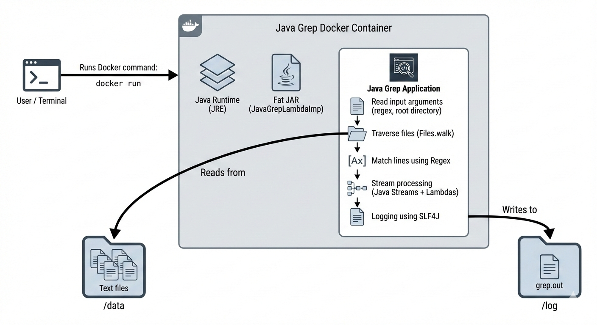

# Java Grep Application

## Introduction

This project is a Java Grep application that searches files recursively in a directory and matches lines based on a given regular expression, similar to the Linux grep command. The application reads input files, applies pattern matching, and writes the matched lines to an output file.
It is implemented using Core Java, Java Streams, Lambda expressions, SLF4J logging, and Maven for dependency management. The application is dockerized for easy deployment and consistent execution across environments.

## Architecture Diagram

This diagram shows how the Java Grep application runs inside a Docker container,
reads input files via mounted volumes, processes them using Java Streams and Regex,
and writes results to an output log file.

## Quick Start
Prerequisites

Java 8+

Docker

Maven

Run using Docker
docker run --rm \
-v $(pwd)/data:/data \
-v $(pwd)/log:/log \
grep-app regex /data /log/grep.out

Where:

regex is the pattern to search

/data contains input files

/log/grep.out is the output file

## Implementation

### Pseudocode
process():
for each file in root directory recursively:
read file line by line
if line matches regex:
write line to output file

### Performance Considerations

The application may face memory issues when processing very large files or directories because all matched lines may be held in memory before writing. To improve performance, results can be written incrementally using buffered streams instead of storing them in a collection. Additionally, file processing can be optimized using stream-based I/O and limiting recursion depth.

## Testing

The application was tested manually by:

Creating sample directories with text files

Using known regex patterns to verify correct matches

Comparing output with Linux grep command results

Testing edge cases such as empty files and no-match scenarios

Verifying logs for correct execution flow

## Deployment

The application is dockerized using a lightweight JRE base image. A fat JAR is created using the Maven Shade Plugin, ensuring all dependencies are bundled. Docker volumes are used to mount input data and output logs, making the application portable and easy to run without local Java setup.

## Improvements

Add parallel file processing to improve performance on large directories

Improve error handling for invalid regex and file permission issues

Add unit tests using JUnit to automate testing instead of manual testing